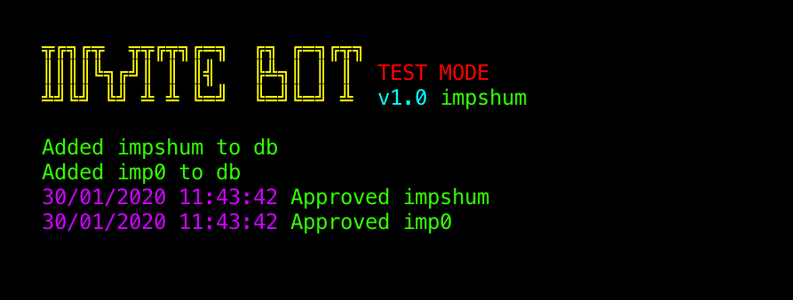

## Reddit Invite Bot

Adds users to the approved users list on a chosen subreddit.

### Instructions

-   Install requirements `pip install -r requirements.txt`
-   Create Reddit (script) app at <https://www.reddit.com/prefs/apps/> and get keys
-   Edit conf.ini with your details
-   Add users to users.txt (one per line)
-   Run it `python run.py`

### Settings Info

-   `target_subreddit` - Bot account must be mod
-   `sleep_time` - Time between approvals (101 seconds recommended)
-   `test_mode` - Run the script without approving users

### Notes

-   The bot will continue where it left off if it's stopped for any reason.
-   If you're not using Unix you won't see the colours in the terminal (command prompt). Follow [THIS](https://recycledrobot.co.uk/words/?print-python-colours) tutorial to get them working.
-   I will not be held responsible for any bad things that might happen to you or your Reddit account whilst using this bot. Follow Reddiquette and stay safe.

### Tip

BTC - 1AYSiE7mhR9XshtS4mU2rRoAGxN8wSo4tK
